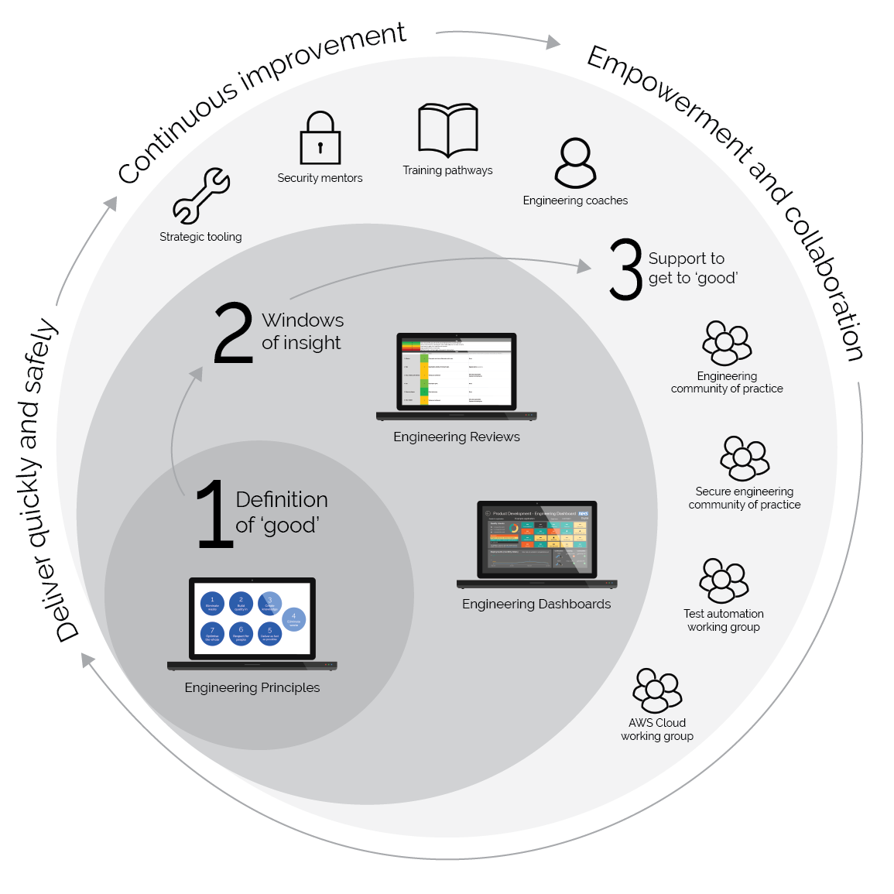

# Software Engineering Quality Framework

## How to get started

See the [Quick Start Guide](quickstart.md)

## Purpose

This framework is concerned with using "good" software engineering to support rapid and safe delivery of high-quality software, at scale

It aims to:
1. Describe a shared (across multiple teams) definition of "good" engineering
2. Provide tools for teams to gain insight into their current engineering maturity levels
3. Provide resources to support teams to increase their engineering maturity levels

## Philosophy

The philosophy underpinning this framework advocates:
* Empowered teams which are accountable for their products
* Rapid, iterative and incremental development: "Release early. Release often. And listen to your customers." (Eric S. Raymond in [The Cathedral and the Bazaar](https://en.wikipedia.org/wiki/The_Cathedral_and_the_Bazaar))
* Reliable services, remembering "Everything fails, all the time" (Werner Vogels), and treating operations as a software engineering challenge (as in Google's [Site Reliability Engineering](https://landing.google.com/sre/))

## Context

The framework is a companion to:
* The [NHS service standard](https://service-manual.nhs.uk/service-standard), with cross-references in this format: [SERVICE-RELIABILITY](https://service-manual.nhs.uk/service-standard/14-operate-a-reliable-service)
* The [NHS Digital architectural principles](https://digital.nhs.uk/about-nhs-digital/our-work/nhs-digital-architecture/principles), with cross-references in this format: [ARCHITECTURE-SECURITY](https://digital.nhs.uk/about-nhs-digital/our-work/nhs-digital-architecture/principles/adopt-appropriate-cyber-security-standards)

## Contents

The framework consists of:

* [Engineering principles](principles.md)
* [Engineering quality review tool](insights/review.md)
* [Communities of practice guidelines](communities/communities-of-practice.md) and active communities:
  * [Product Development Test Automation Working Group](communities/pd-test-automation-working-group.md)
  * [Product Development Engineering CoP](communities/pd-engineering-cop.md)
  * [Product Development Cloud PaaS Working Group](communities/pd-cloud-working-group.md)
  * [Secure Engineering CoP](communities/security-cop.md)
* Guidance on how to practice [continuous improvement](continuous-improvement.md)

## Contributing
See our [contributor's guide](./.github/CONTRIBUTING.md)
