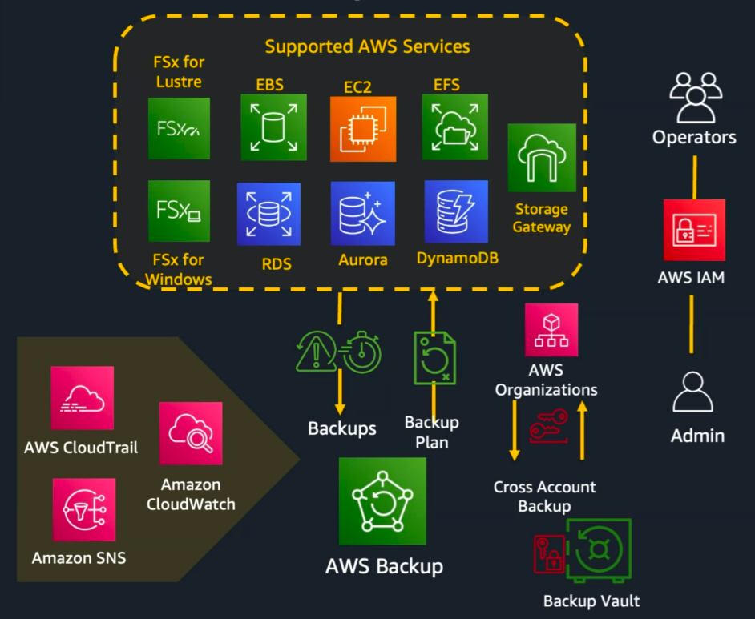
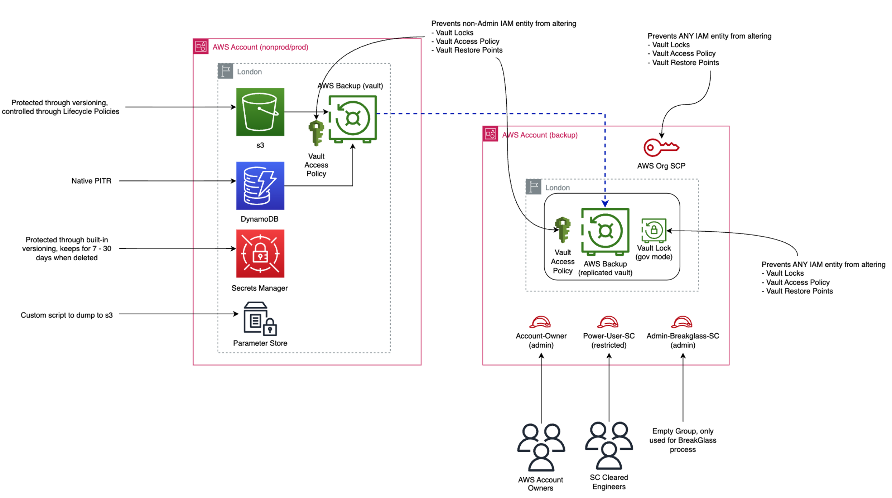

# Cross-account backups on AWS

## Context

- These notes are part of a broader set of [blueprints](../blueprints.md)
- This blueprint relates to [service reliability](../practices/service-reliability.md) and specifically to use of [cloud services](../practices/cloud-services.md)

## Requirements

The Backup Policy is supported by two additional papers – the Backup Standard and the Backup Design Pattern. These documents include the following backup requirements on the NHS England services:

- *"critical data is saved in multiple backup locations"*
- *"at least 3 copies"*
- *"on 2 separate devices"*
- *"1 copy being stored off-site and offline or be immutable by online means"*
- *"ensure information & systems can be restored after an incident including but not limited to ransomware and insider attack"*
- *"in line with (RPO & RTO) Recovery Point Objectives and Recovery Time Objectives"*

## Purpose

- To protect NHS patients' data
- To ensure NHS services remain available to the patients
- To comply with legal and regulatory requirements

Associated documents:

- Backup Policy
- Backup Standard
- Backup Design Pattern

## Supported services

## Example: DynamoDB & S3

