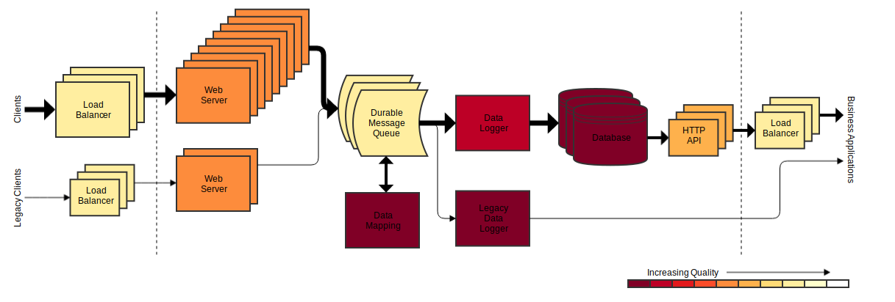

# Continuous improvement

Continuous improvement is the practice of iteratively reviewing processes and impediments and making incremental changes to reduce waste and increase quality.

## To do

Training
Scrum.org improvement Kata (Joan has links)
Software engineering focused (true, OK)

## Quick start

This document provides some theory and advice on practising continuous improvement. But you don’t need a lot of process to get going. There will almost certainly be problems people are already aware of which provide a great starting point for improvement work.

Set up regular retrospectives with the whole team and make a commitment to spend some time acting on the things which are uncovered. Don’t bite off more than you can chew: pick one or two changes which you think will be achievable in the next Sprint/iteration.

Set out with the intention of having this as a permanent part of how you work, iteratively checking how things are, thinking of what to do to improve things, making a small change and repeating.

> **Example**
>
> During a retrospective, the team identify that the product owner frequently finds issues with features once they have been implemented, causing costly rework late in the delivery cycle.
>
> They consider various options, including adding more detailed requirements to stories during sprint planning, introducing a just in time "analysis and elaboration" stage to their agile process, and showing the working software to the product owner during development for earlier feedback.
>
> They can see potential value in all three, but decide to choose one to start with, remembering that continuous improvement is an iterative process. Because the product owner is often busy and is sometimes not available at short notice, they decide to try adding more detailed requirements to stories during sprint planning.
>
> Teams who find it is easier to get input from the product owner at short notice may prefer to add the "analysis and elaboration" stage instead to get the benefit of doing this analysis just in time. It is important to choose the right action for the specific scenario the team is facing.

## Improvement cycles

It is common to describe the iterative continuous improvement process as a cycle, and two common models are Plan-Do-Check-Act (PDCA) and Observe-Orient-Decide-Act (OODA). Both give a mental model, rather than a process to follow, so feel free to refer to either one &mdash; or neither.

### Plan-Do-Check-Act

The PDCA cycle attributed to Demming and Shewhart, and here adapted from [ASQ](https://asq.org/quality-resources/continuous-improvement), has four stages which are performed in a continuous loop:
* **Plan**: Identify an opportunity and plan for change.
* **Do**: Implement the change on a small scale.
* **Check**: Use data to analyse the results of the change and determine whether it made a difference.
* **Act**: If the change was successful, reinforce it or implement it on a wider scale and continuously assess your results. If the change did not work, begin the cycle again &mdash; i.e. try a different approach to driving improvement in this area.

At any one time, you may have several improvement initiatives in progress.

### Observe-Orient-Decide-Act

The OODA loop was devised by John Boyd and has a similar, but slightly different structure:
* **Observe** that there is a problem.
* **Orient**: seek to understand the causes by seeing the problem in an unbiased way.
* **Decide** on your next step, typically a small experimental change.
* **Act**: make the change.
* **Observe** (again): continue round the loop repeatedly observing what the biggest problems are and focusing on tackling them iteratively.

## Benefits

Continuous improvement has significant benefits for teams.

### Maintain and improve processes

Improving processes:

*	reduces waste leading to improved efficiency and productivity.
*	improves quality and reduce error rates.
*	leads to happier people and improved engagement, retention, and recruitment.

It takes continuous effort to maintain and evolve processes in response to challenges and changing circumstances. Without this effort, productivity and quality decline over time.

### Control technical debt

Technical debt arises due to processes or practices in the past, but has an ongoing impact on the present.

Technical debt:
*	leads to bugs and loss of reliability.
*	means changes take longer.
*	makes it harder to predict how long any given change will take.
*	causes dissatisfaction and disengagement in the team.

Without sustained improvement effort these all get worse over time, reducing capacity to deliver features. If little or no tech debt improvement work is done, delivery may initially be faster, but over time it becomes progressively slower and less predictable.

## Identifying improvement opportunities

Regular team retrospectives are an effective way to identify improvement opportunities and actions. Another potential source are periodic reviews using tools such as the the [AWS](https://aws.amazon.com/architecture/well-architected/) or [Azure](https://azure.microsoft.com/en-gb/blog/introducing-the-microsoft-azure-wellarchitected-framework/) Well-Architected Frameworks and the [NHS Digital quality review](review.md).

As discused in [Benefits](#benefits), in high level terms the opportunities for reducing waste or improving quality tend to be in two areas:

### 1. Process or practice

The [Lean principles](principles.md) give some useful areas to consider.

Examples include:
* The way stories are analysed or elaborated.
* The way code is written or reviewed.
* The tools and techniques for testing.
* Communication and collaboration mechanisms within and between teams.
* Team structures.

### 2. Technical debt

Examples include:
* Code which needs to be refactored.
* Technologies which should be replaced.
* Areas with insufficient, inefficient or ineffective testing.

## Prioritising

Choose changes which will have the most impact for the effort involved. If you have lots of potential options, you will want to prioritise them. One option is to score how much each will move the [metrics](#measurement) that matter to you &mdash; its _value_ &mdash; and use [Weighted Shortest Job First](https://blackswanfarming.com/wsjf-weighted-shortest-job-first/), which prioritises items with the highest `(value + urgency) / effort` ratio. Value, urgency and effort are judgements and estimates in arbitrary relative units, and it is common to use a [modified Fibonacci](https://www.mountaingoatsoftware.com/blog/why-the-fibonacci-sequence-works-well-for-estimating) scale (1, 2, 3, 5, 8, ...).

### Prioritising tech debt

It can be useful to apply a little more structure to help with the difficult job of judging the value of fixing any given bit of technical debt. It is helpful to focus on the impact that each bit of tech debt is having by considering aspects such as those listed in [Benefits &mdash; Control technical debt](#control-technical-debt). The score for each of those aspects will depend on how heavily that part of the system is worked on. By summing the individual scores for each of those aspects you can derive a measure of the total impact, which conveniently also works as a measure of the value of fixing it.

So: `value = bugs + delays + uncertainty + unhappiness`, which can be fed into Weighted Shortest Job First prioritisation as above.

Visualising your tech debt using an approach like [quality views](https://blog.colinbreck.com/using-quality-views-to-communicate-software-quality-and-evolution/) can help facilitate conversations about tech debt and where to focus efforts.

[Image from Colin Breck]

## Acting

Treat changes as experiments and consider ways to explore them safely, e.g. only apply the change to some of the work or be explicit that it is a trial to be re-evaluated at a predetermined time (usually at the next retrospective).

Be clear what benefit you hope to get from each change so that you can objectively [measure](#measurement) whether it has been a success and either reinforce or reverse the change.

Break down larger problems into smaller ones which can be tackled with smaller changes more incrementally.

> **Example**
>
> The problem "_We don't communicate enough with the other team working in this area._"
>
> could break down into several more specific points, helping drive incremental action:
> 1. _We don't have visibility of each other's backlogs_
> 2. _We don't coordinate changes and end up clashing_
> 3. _We don't have the same code style_
> 4. _We don't have the same test approach_

## Measurement

When seeking to [identify](#identifying-improvement-opportunities) and [prioritise](#prioritising) improvements, it can be helpful to have agreed metrics as a guide. These will be specific to each team, but some good defaults to start with are:
* Deployment frequency
* Lead time for changes
* Incident rate
* Mean time to recover
* Team happiness
* Proportion of time being spent on:
  * Features
  * Bug fixing
  * Operability
  * Tech debt
  * Other improvement work

## Closing remarks

As we have seen, the recipe to start or give a boost to continuous improvement is essentially very simple:
1. Make a start, keeping changes small and iterating.
2. Bake improvement work into the way you work with regular retrospectives which feed a trickle of improvement work into your activity within each Sprint/iteration.
3. Track metrics over time so you can measure the effect of improvement work.
