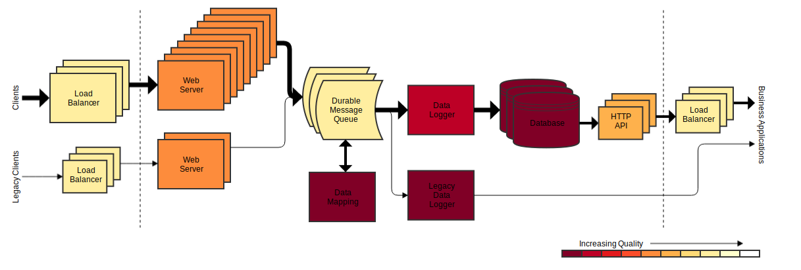

# Continuous improvement

Continuous improvement is the practice of iteratively reviewing processes and impediments and making incremental changes to reduce waste and increase quality.

## Quick start

This document provides some theory and advice on practising continuous improvement. But you don't need a lot of process to get going. There will almost certainly be problems people are already aware of which provide a great starting point for improvement work.

Set up regular retrospectives with the whole team and make a commitment to spend time acting on the things which are uncovered. Don't bite off more than you can chew: pick one or two changes which you think will be achievable in the next Sprint.

Set out with the intention of having this as a permanent part of how you work, iteratively checking how things are, thinking of what to do to improve things, making a small change and repeating.

> **Example**
>
> During a retrospective, the team identify that the product owner frequently finds problems with features once they have been implemented, causing costly rework late in the delivery cycle.
>
> They consider various options, including adding more detailed requirements to stories during Sprint planning, introducing a just in time "analysis and elaboration" stage to their agile process, and showing the working software to the product owner during development for earlier feedback.
>
> They can see potential value in all three, but decide to choose one to start with, remembering that continuous improvement is an iterative process. Because the product owner is often busy and is sometimes not available at short notice, they decide to try adding more detailed requirements to stories during Sprint planning.
>
> Teams who find it is easier to get input from the product owner at short notice may prefer to add the "analysis and elaboration" stage instead to get the benefit of doing this analysis just in time. It is important to choose the right action for the specific scenario the team is facing.

## Improvement Kata

The [Improvement Kata](https://www.atlassian.com/agile/agile-at-scale/using-improvement-kata-to-support-lean) is a product of the [Toyota Production System](https://global.toyota/en/company/vision-and-philosophy/production-system/) and provides a useful structure for wrapping continuous improvement activities:
1. Understand the direction or challenge &mdash; expressed as a [measurable signal](#measurement) e.g. _Increase the number of deployments per month_
1. Grasp the current condition &mdash; e.g. _We deploy once per month_
1. Define the target destination &mdash; e.g. _Able to deploy on demand, up to several times per day_
1. Move toward the target iteratively, which reveals obstacles to overcome &mdash; using [Plan-Do-Check-Act improvement cycles](#plan-do-check-act-improvement-cycles)

## Plan-Do-Check-Act improvement cycles

It is common to describe the iterative continuous improvement process as a cycle, and the most common is called Plan-Do-Check-Act (PDCA). This gives a mental model rather than a process to follow, but this can still be useful when adopting and maintaining continuous improvement. The PDCA cycle is attributed to Demming and Shewhart, and here adapted from [ASQ](https://asq.org/quality-resources/continuous-improvement), has four stages which are performed in a continuous loop:
* **Plan**: Identify an opportunity and plan for change.
* **Do**: Implement the change on a small scale.
* **Check**: Use data to analyse the results of the change and determine whether it made a difference.
* **Act**: If the change was successful, reinforce it or implement it on a wider scale and continuously assess your results. If the change did not work, begin the cycle again &mdash; i.e. try a different approach to driving improvement in this area.

At any one time, you may have several improvement initiatives in progress.

## Benefits

Continuous improvement has significant benefits for teams.

### Maintain and improve processes

Improving processes:

*	Reduces waste, leading to improved efficiency and productivity.
*	Improves quality and reduce error rates.
*	Leads to happier people and improved engagement, retention, and recruitment.

It takes continuous effort to maintain and evolve processes in response to challenges and changing circumstances. Without this sustained effort, productivity and quality decline over time.

### Control technical debt

Technical debt is a term which refers to things about the way a system is built which are not apparent to users of the system, but impact the ability of the team to make changes to it quickly and safely. Tech debt arises due to processes or practices in the past, but has an ongoing impact on the present.

Technical debt:
*	Leads to bugs and loss of reliability.
*	Means changes take longer.
*	Makes it harder to predict how long any given change will take.
*	Causes dissatisfaction and disengagement in the team.

Without sustained improvement effort these all get worse over time, reducing capacity to deliver features. If little or no tech debt improvement work is done, delivery may initially be faster but over time it becomes progressively slower and less predictable.

### Improve reliability and operability

Some important improvement work consists of implementing or improving reliability or operability features, such as monitoring dashboards, application logs or automated security testing.

Where things like this are missing or need improvement, it is not tech debt &mdash; improving them brings a tangible benefit to service reliability, which users do notice and care about.

The benefits of improving these areas are:
* Service has fewer bugs.
* Performance is more reliable.
* Services are more available.
* Services are more secure.
* Incidents are less severe.
* Incidents are detected earlier.
* Incidents are fixed more quickly.

## Identifying improvement opportunities

Regular team retrospectives are an effective way to identify improvement opportunities and actions. Another potential source are periodic reviews using tools such as the the [AWS](https://aws.amazon.com/architecture/well-architected/) or [Azure](https://azure.microsoft.com/en-gb/blog/introducing-the-microsoft-azure-wellarchitected-framework/) Well-Architected Frameworks and the [NHS Digital quality review](insights/review.md). And of course, tech debt is often uncovered in the course of making changes to a system.

As discused in [Benefits](#benefits), in high level terms the opportunities for reducing waste or improving quality tend to be in these areas:

### 1. Process or practice

The [Lean principles](principles.md) give some useful areas to consider.

Examples include:
* The way stories are analysed or elaborated.
* The way code is written or reviewed.
* The tools and techniques for testing.
* Communication and collaboration mechanisms within and between teams.
* Team structures.

### 2. Technical debt

Examples include:
* Code which needs to be refactored.
* Technologies which should be replaced.
* Areas with insufficient, inefficient or ineffective testing.

### 3. Reliability and operability

Examples include:
* Automated build and deployment pipelines.
* Monitoring dashboards.
* Automated alerts.
* Application logs.
* Automated security testing.

## Prioritising

Select items which will have the most impact for the effort required. If you have many potential options, you will want to prioritise them. One option is to score how much each will move the [metrics](#measurement) that matter to you &mdash; its _value_. You can then use [Weighted Shortest Job First](https://blackswanfarming.com/wsjf-weighted-shortest-job-first/) prioritisation, selecting items with the highest ratio of
```
(value + urgency) / effort
```
Value, urgency and effort are judgements and estimates in arbitrary relative units, and it is common to use a [modified Fibonacci](https://www.mountaingoatsoftware.com/blog/why-the-fibonacci-sequence-works-well-for-estimating) scale (1, 2, 3, 5, 8, ...) for each.

### Prioritising tech debt

There is a lot of mileage in following the [scout's rule](https://www.scout.org/sites/default/files/news_files/Leave%20the%20world%20a%20little%20better%20than%20you%20found%20it.pdf) as [applied to coding by Uncle Bob](https://www.oreilly.com/library/view/97-things-every/9780596809515/ch08.html) &mdash;

> always leave the code behind in a better state than you found it

&mdash; a practice which Martin Fowler calls [opportunistic refactoring](https://martinfowler.com/bliki/OpportunisticRefactoring.html). Making time for this as part of feature work is a very effective way to make incremental improvements to a codebase over time. Factor in any time needed for refactoring or other tech debt improvement when estimating features.

Of course, sometimes you uncover issues which are just to big to tackle as part of an individual feature. For these more substantial issues, it can be useful to apply a little more structure to help with the difficult job of judging the value of fixing any given bit of technical debt. It is helpful to focus on the impact that each is having by considering aspects such as those listed in [Benefits &mdash; Control technical debt](#control-technical-debt), shortened here as _bugs_, _delays_, _uncertainty_ and _unhappiness_. The score for each of those aspects will depend on how heavily that part of the system is worked on. Another important consideration is the business _criticality_ of the affected part of the system. By combining the individual scores for each of those aspects you can derive a measure of the total impact, which conveniently also works as a measure of the value of fixing it, which can be fed into Weighted Shortest Job First prioritisation as above.

```
value = criticality x (bugs + delays + uncertainty + unhappiness)
```

Visualising technical debt using an approach like Colin Breck's [Quality Views](https://blog.colinbreck.com/using-quality-views-to-communicate-software-quality-and-evolution/) can help facilitate conversations about how much improvement effort is required and where it should be focussed.


[Example Quality View by Colin Breck]

## Acting

Treat changes as experiments and consider ways to explore them safely. For example, only apply the change to some of the work or be explicit that it is a trial to be re-evaluated at a predetermined time (usually at the next retrospective).

Be clear what benefit you hope to get from each change so that you can objectively [measure](#measurement) whether it has been a success and either reinforce or reverse the change.

Express each experiment as a hypothesis:

> To support _\<[Improvement Kata](#improvement-kata) direction or challenge\>_,<br>
> we believe _\<this capability\>_<br>
> will result in _\<this outcome\>_.<br>
> We will have confidence to proceed when _\<we see a measurable signal\>_.
>
> **Example**<br>
> To support **increasing the number of deployments per month**,<br>
> we believe **automating regression tests for our website**<br>
> will result in **shorter test cycles**.<br>
> We will have confidence to proceed when **regression test cycles are shorter, and the rate of bugs being missed by has not risen noticeably**.

Break down larger problems into smaller ones which can be tackled with smaller changes more incrementally.

> **Example**
>
> The problem "_We don't communicate enough with the other team working in this area._" could break down into several more specific points, helping drive incremental action:
> 1. _We don't have visibility of each other's backlogs_
> 2. _We don't coordinate changes and end up clashing_
> 3. _We don't have the same code style_
> 4. _We don't have the same test approach_

## Making time

Some teams have success with forming a single backlog covering feature and improvement work. This requires product and tech people to work together and build a shared understanding of the relative priority of each item so that a single priority order can be decided.

Other teams find it too difficult to determine relative priorities between features and improvement work and instead use a time budget approach. For example, they may decide that each Sprint roughly 70% of the capacity should go into feature and bug fix work and the remaining 30% into operability and improvement work. The appropriate split will depend on the specific situation the team finds themselves in, and can vary over time.

## Measurement

When seeking to [identify](#identifying-improvement-opportunities) and [prioritise](#prioritising) improvements, it can be helpful to have agreed metrics as a guide. These will be specific to each team, but some good defaults to start with are:
* Deployment frequency
* Lead time for changes
* Incident rate
* Mean time to recover
* Team happiness

In addition, it is useful to track the proportion of time being spent on various activities so that the balance can be corrected if required:
  * Features
  * Bug fixing
  * Operability
  * Tech debt
  * Other improvement work

## What does this mean for me as a less-technical person?

To do

## What does this mean for me as a technical person?

If you are an Engineer or Tester, continuous improvement will help you:
* Reduce waste and spend more time delivering value for users.
* Implement features and fix bugs more quickly and safely.
* Spend less time on menial or repetitive work.

You have an important role to play!
* Make sure you understand the user needs well enough to have an informed conversation about the relative priority of the functional work items.
* Express technical work in terms of the benefits it will deliver so that as a team you can have a meaningful conversation about relative priorities.
* Play an active role in backlog refinement and planning, ensuring that operability and reliability work is adequately represented.
* Be bold and make sure technical quality is maintained.
  * But also, be pragmatic and accept that all systems have imperfections and some degree of tech debt.

## Closing remarks

As we have seen, the recipe to start or give a boost to continuous improvement is essentially very simple:
1. Make a start, keeping changes small and iterating.
2. Bake improvement work into the way you work with regular retrospectives which feed a trickle of improvement work into your activity within each Sprint.
3. Track metrics over time so you can measure the effect of improvement work.
