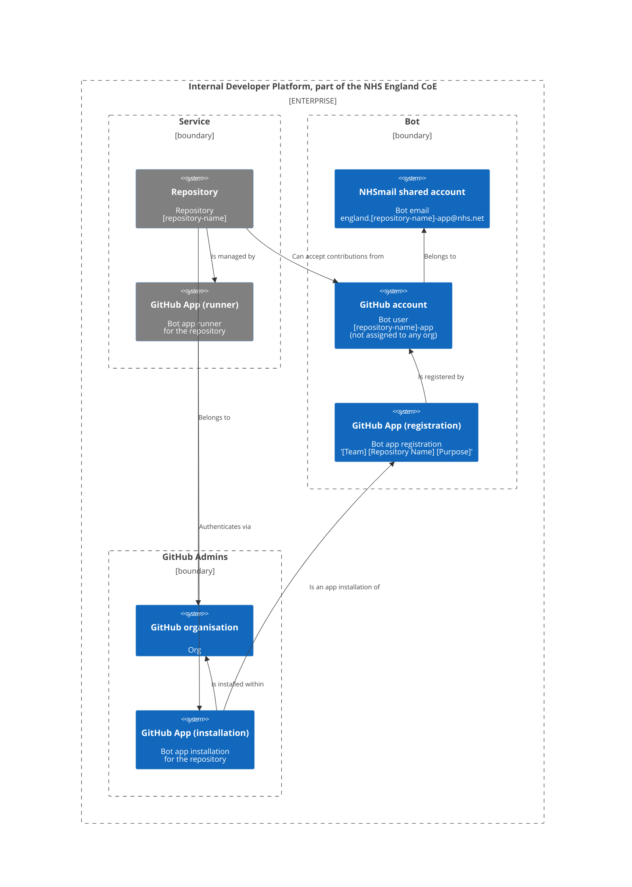
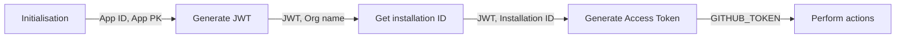

# ADR-003: Acceptable use of GitHub authentication and authorisation mechanisms

>|              | |
>| ------------ | --- |
>| Date         | `04/09/2023` |
>| Status       | `RFC` |
>| Deciders     | `Engineering` |
>| Significance | `Construction techniques` |
>| Owners       | `Amaan Ibn-Nasar, Jacob Gill, Dan Stefaniuk` |

---

- [ADR-003: Acceptable use of GitHub authentication and authorisation mechanisms](#adr-003-acceptable-use-of-github-authentication-and-authorisation-mechanisms)
  - [Context](#context)
  - [Decision](#decision)
    - [Assumptions](#assumptions)
    - [Drivers](#drivers)
    - [Options](#options)
    - [Outcome](#outcome)
      - [Built-in authentication using `GITHUB_TOKEN` secret](#built-in-authentication-using-github_token-secret)
      - [GitHub PAT (fine-grained Personal Access Token)](#github-pat-fine-grained-personal-access-token)
      - [GitHub App](#github-app)
    - [Rationale](#rationale)
  - [Notes](#notes)
    - [GitHub App setup](#github-app-setup)
      - [Recommendation for GitHub Admins](#recommendation-for-github-admins)
    - [Diagram](#diagram)
      - [Context diagram showing the GitHub App setup](#context-diagram-showing-the-github-app-setup)
      - [Authentication flow diagram](#authentication-flow-diagram)
    - [Limitations](#limitations)
    - [Examples of acquiring access token](#examples-of-acquiring-access-token)
  - [Actions](#actions)
  - [Tags](#tags)
  - [Footnotes](#footnotes)

## Context

As teams increasingly adopt GitHub and invest in refining development processes, there is a growing need to facilitate automated bot access to repositories, for tasks such as managing Pull Requests or integrating self-hosted runners with preferred Cloud providers. While GitHub's official documentation provides detailed technical instructions, it might not always offer a clear and holistic understanding of the platform's authentication and authorisation mechanisms. This document seeks to bridge that gap. It elucidates not just the "_how_" but also the "_why_", "_when_", and "_what_" behind these mechanisms, aiming to promote both effective and secure usage.

## Decision

### Assumptions

_A **GitHub App** is a type of integration that you can build to interact with and extend the functionality of GitHub. You can build a GitHub App to provide flexibility and reduce friction in your processes, without needing to sign in a user or create a service account._ [^1]

_**Personal access tokens** are an alternative to using passwords for authentication to GitHub when using the GitHub API or the command line. Personal access tokens are intended to access GitHub resources on behalf of yourself._ [^2]

_When you enable GitHub Actions, GitHub installs a GitHub App on your repository. The **GITHUB_TOKEN** secret is a GitHub App installation access token. You can use the installation access token to authenticate on behalf of the GitHub App installed on your repository._ [^3]

### Drivers

The aim of this decision record, or more precisely, this guide, is to provide clear guidelines on the appropriate use of GitHub's authentication and authorisation mechanisms. Our objective is to ensure that any automated process utilises correct authentication when executing GitHub Actions and Workflows. These processes underpin the implementation of the CI/CD (Continuous Integration and Continuous Delivery) pipeline. By adhering to these guidelines, we can maintain robust, secure and effective operations.

### Options

There are three options available to support automated GitHub Action and Workflow authentication processes:

1. [Built-in authentication](https://docs.github.com/en/actions/security-guides/automatic-token-authentication) using `GITHUB_TOKEN` secret

   - ➕ **No set-up required**. It works effortlessly, even for forked repositories.
   - ➕ **The token can only access the repository containing the workflow file**. This token cannot be used to access other private repositories.
   - ➖ **The token can only access a repository containing the workflow file**. If you need to access other private repositories or require write access to other public repositories this token will not be sufficient.
   - ➖ **The token cannot trigger other workflows**. If you have a workflow that creates a release and another workflow that runs when someone creates a release, the first workflow will not trigger the second workflow if it utilises this token based mechanism for authentication.

2. [GitHub PAT](https://docs.github.com/en/authentication/keeping-your-account-and-data-secure/managing-your-personal-access-tokens) (fine-grained Personal Access Token)

   - ➕ **Simple to set up**. You can create a [fine-grained personal access token](https://github.com/settings/tokens?type=beta) with a repository scope. Classic personal access token should never be used.
   - ➕ **GitHub PAT provides a more fine-grained permission model** than the built-in `GITHUB_TOKEN`
   - ➕ **The token can trigger other workflows**.
   - ➖ **It is bound to a person**. The owner of the token leaving the organisation can cause your workflow to break.

3. [GitHub App](https://docs.github.com/en/apps/creating-github-apps/about-creating-github-apps/about-creating-github-apps)

   - ➕ **You can control which repositories your token has access to** by installing the GitHub App to selected repositories.
   - ➕ **An organisation can own multiple GitHub Apps** and they do not consume a team seat.
   - ➕ **GitHub App provides a more fine-grained permission model** than the built-in `GITHUB_TOKEN`
   - ➕ **The token can trigger other workflows**.
   - ➖ **Not very well documented**. Despite the extensive content of the GitHub documentation, it does not effectively communicate the pros & cons, use-cases and comparison of each authentication method. This was one of the reasons we created this ADR.
   - ➖ **The setup is a bit more complicated**.

### Outcome

#### Built-in authentication using `GITHUB_TOKEN` secret

A `GITHUB_TOKEN` is automatically generated and used within GitHub Action and Workflow for tasks related to the current repository such as creating or updating issues, pushing commits, etc.

- **Scope**: The `GITHUB_TOKEN` is automatically created by GitHub in each run of a GitHub Action and Workflow, with its scope restricted to the repository initiating the workflow. The permissions of the `GITHUB_TOKEN` are limited to read and write access to the repository files, with an exception of write access to the `.github/workflows` directory.
- **Life Span**: The `GITHUB_TOKEN` has a temporary lifespan automatically expiring after the completion of the job that initiated its creation.

This method <u>enables basic operations</u> expected from the repository pipeline, like accessing GitHub secret variables.

#### GitHub PAT (fine-grained Personal Access Token)

Use personal access token when:

- **Scripted access**: When you are writing scripts that automate tasks related to your repositories PATs can be a good choice. These tokens can authenticate your script with GitHub allowing it to perform various operations like cloning repositories, creating issues, or fetching data from the API. Since PATs can act with nearly all the same scopes as a user, they can be a versatile tool for script-based interactions with your repositories.

- **Command-line access**: If you are directly using the GitHub API from the command-line (e.g. with `curl`), PATs provide a convenient way to authenticate. They allow you to perform a wide range of actions, including getting the number of stars on a repository, posting a comment on an issue or triggering a new build or deployment. In this use case a common task that a contributor has to perform daily can be automated using a PAT generated with a scope specifically for it.

- **Two-Factor Authentication (2FA)**: If you have enabled 2FA for added account security, performing `https` Git operations like clone, fetch, pull or push will require a PAT instead of a password. This helps ensure that operations remain secure even from the command-line.

Do not use it when:

- **Sharing your account**: PATs should never be used to provide access to your GitHub account to others. Instead, use GitHub's built-in features for collaboration and access management, such as adding collaborators to repositories or using organisations and teams.

- **Public repositories or code**: PATs provide broad access to your account, so you should never embed them in your code, especially if that code is public. This could allow someone to take control of your account, modify your repositories or steal your data. The [scan secrets functionality](../../docs/user-guides/Scan_secrets.md) that is part of this repository template should prevent you from doing so anyway.

- **Broad permissions**: While PATs can have broad permissions, you should aim to restrict each token's scope to what is necessary for its purpose. For instance, a token used only for reading repository metadata does not need write or admin access.

- **Long-term usage without rotation**: To limit potential exposure of your PAT, it is recommended to periodically change or "rotate" your tokens. This is a common security best practice for all kinds of secret keys or tokens.

This method of authentication and authorisation using the fine-grained PAT for the purpose of automation should mostly be <u>used by the GitHub organisation owners, administrators and maintainers</u>.

#### GitHub App

Use app when:

- **Acting on behalf of a user or an organisation**: GitHub Apps can be installed directly onto an organisation or a user account and can access specific repositories. They act as separate entities and do not need a specific user to authenticate actions, thus separating the app's actions from individual users and preventing user-related issues (like a user leaving the organisation) from disrupting the app's operation. In this model, a GitHub App can act on behalf of a user to perform actions that the user has permissions for. For example, if a GitHub App is used to manage issues in a repository, it can act on behalf of a user to open, close, or comment on issues. The actions the app can perform are determined by the user's permissions and the permissions granted to the app during its installation.

- **When you need fine-grained permissions**: GitHub Apps provide more detailed control over permissions than the classic PAT, which should no longer be used. You can set access permissions on a per-resource basis (issues, pull requests, repositories, etc.). This allows you to follow the principle of least privilege, granting your app only the permissions it absolutely needs.

- **Webhook events**: GitHub Apps can be configured to receive a variety of webhook events. Unlike personal tokens, apps can receive granular event data and respond accordingly. For instance, an app can listen for `push` events to trigger a CI/CD pipeline or `issue_comment` events to moderate comments.

- **Server-to-server communication**: Unlike users, GitHub Apps have their own identities and can perform actions directly on a repository without a user action triggering them. They are associated with the GitHub account (individual or organisation) that owns the app, not necessarily the account that installed the app. In this model the GitHub App can perform actions based on the permissions it was given during setup. These permissions are separate from any user permissions and allow the app to interact with the GitHub API directly. For example, an app might be set up to automatically run a test suite whenever code is pushed to a repository. This action would happen regardless of which user pushed the code.

This method of authentication and authorisation is <u>intended for the engineering teams</u> to implement and support automated processes. Setting up the [GitHub OAuth App](https://docs.github.com/en/apps/oauth-apps/building-oauth-apps/authorizing-oauth-apps) access is outside the scope of this document as this mechanism should not be employed in the context of development process automation.

### Rationale

This guide describes the essence of the fundamental aspects of GitHub authentication and authorisation mechanisms along with the common use cases identified by the GitHub organisation administrators of the NHS England.

## Notes

### GitHub App setup

To be executed by a GitHub organisation administrator:

- Identify the GitHub repository name for which the team has requested a GitHub App integration
- Create a shared email address [england.[repository-name]-app@nhs.net](england.[repository-name]-app@nhs.net) by filling in the `New shared mailbox request` form using the Internal Portal (ServiceNow)
  - Delegate access to this mailbox for the GitHub organisation owners, administrators and the engineering team
- Create a GitHub bot account named `[repository-name]-app` using the email address mentioned above. The bot account should not be added to the organisation; therefore, **no GitHub seat will be taken**. It serves as an identity, but authentication and authorisation are handled via the GitHub App. This avoids granting the bot admin permissions to the repository, enabling commits to be signed by that bot account. Access is controlled solely through the GitHub App.
  - Use the `nhs.net` email address as the default and only email
  - Set the email address as private
  - Make profile private and hide any activity
  - Block command line pushes that expose email
  - Set up commit signing
  - Flag unsigned commits as unverified
- [Register new GitHub App](https://docs.github.com/en/apps/creating-github-apps/registering-a-github-app/registering-a-github-app) under the `[repository-name]-app` bot account with a name following a pattern that could include information like `[Team] [Repository Name] [Purpose]`, which would help to search for and identify owners of the app once it is installed within the GitHub organisation
  - Make note of the `App ID`
  - Generate and store securely a `Private key` for the app
  - Provide a `Homepage URL` to the repository this app will operate on
  - Make this app `public`
  - Set the relevant `Repository permissions` based on the team's requirements. There should be no organisation or account permissions set at all

To be executed by a GitHub organisation owner:

- Install the `[Team] [Repository Name] [Purpose]` app on the GitHub organisation and set repository access to the `[repository-name]` only

#### Recommendation for GitHub Admins

It is advisable to create a separate bot account for each service or programme. This approach fosters responsible ownership practices. It also allows the team to use the bot's identity for signing commits and integrating their service with other SaaS products, such as SonarCloud, without relying on individual team member accounts. Exceptions can be made on a case-by-case basis, allowing for the use of a central organisation account instead.

### Diagram

#### Context diagram showing the GitHub App setup

Please see the above being implemented for the _update from template_ capability:

- [Repository and GitHub App (runner)](https://github.com/nhs-england-tools/update-from-template-app) for the "Update from Template" app. The runner is built on a GitHub Action but it can be a serverless workload or self-hosted compute
- [GitHub account (bot)](https://github.com/update-from-template-app) linked to an `nhs.net` email address, but not part of any GitHub organisation
- [GitHub App (registration)](https://github.com/apps/nhs-england-update-from-template) to be installed within the GitHub organisations in use, e.g. `nhs-england-tools`

#### Authentication flow diagram

The diagram below represents all the steps needed for an app implementation (aka app runner) to be authenticated and authorised to perform operations defined by the GitHub App registration and installation.

### Limitations

- Only 100 app registrations are allowed per user or organisation, but there is [no limit on the number of installed apps](https://docs.github.com/en/apps/creating-github-apps/registering-a-github-app/registering-a-github-app#about-registering-github-apps)
- [Access rate limits apply](https://docs.github.com/en/apps/creating-github-apps/registering-a-github-app/rate-limits-for-github-apps) depending on the number of repositories or users within organisation
- The app name cannot exceed 34 characters

### Examples of acquiring access token

- [Bash](./assets/ADR-003/examples/bash/README.md)
- [Golang](./assets/ADR-003/examples/golang/README.md)
- [Node.js TypeScript (Octokit)](./assets/ADR-003/examples/nodejs/README.md) - This is our preferred method for implementing GitHub Apps. It is supported by the Octokit library, which is an official client for the GitHub API.
- [Python](./assets/ADR-003/examples/python/README.md)

## Actions

- [ ] Provide an example of commit signing by bot in the unattended mode, i.e. include a link on how this is implemented in the [Update from Template](https://github.com/nhs-england-tools/update-from-template-app/blob/c1b87f3aaa568caf4a8bfdd5b07d0c4ef88a2e4a/entrypoint.sh#L81) app.

## Tags

`#maintainability, #security`

## Footnotes

[^1]: [About creating GitHub Apps](https://docs.github.com/en/apps/creating-github-apps/about-creating-github-apps/about-creating-github-apps)
[^2]: [Managing your personal access tokens](https://docs.github.com/en/authentication/keeping-your-account-and-data-secure/managing-your-personal-access-tokens)
[^3]: [Publishing and installing a package with GitHub Actions](https://docs.github.com/en/packages/managing-github-packages-using-github-actions-workflows/publishing-and-installing-a-package-with-github-actions)
