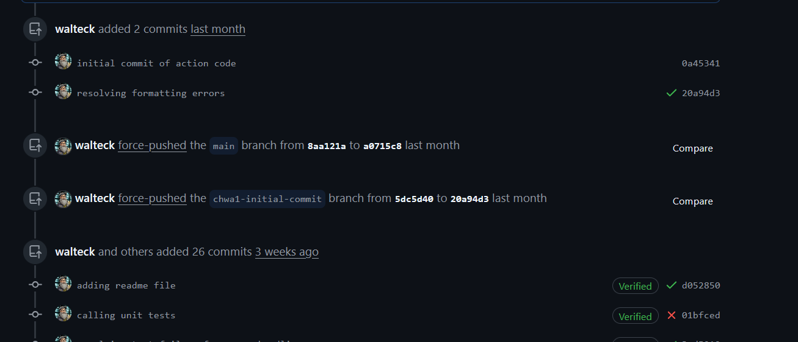
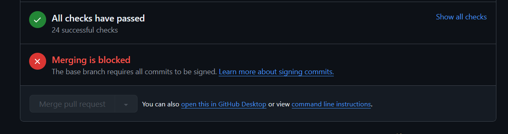
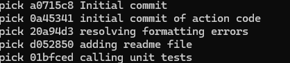
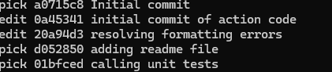
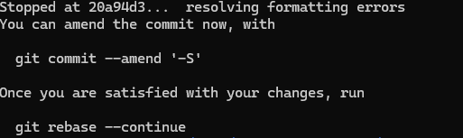
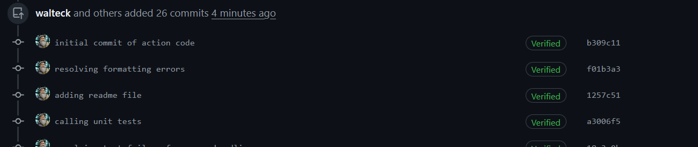

# Retrospective commit signing guide

- [Retrospective commit signing guide](#retrospective-commit-signing-guide)
  - [Signing previously pushed commits](#signing-previously-pushed-commits)
    - [Steps](#steps)

## Signing previously pushed commits

If you have pushed a commit without signing this can result in your PR not being able to be merged into the main or default branch. The following steps will guide you through retrospectively signing your commits. Note you can sign multiple commits if required.

Please take the time to understand the commands that you are using, this is just a guide.

### Steps

1. **Identify unsigned commits**  
   You have a branch that contains one or more unsigned commits. In the screenshot below, there are two unsigned commits followed by two commits showing the `Verified` label, which indicates they were signed.

   

2. **Understand the issue**  
   The first two commits aren't verified, and therefore the merge to the `main` branch is not allowed:

   

3. **Switch to the branch with unsigned commits**  
   Go to your CLI and ensure that you are on the branch with the unsigned commits.

4. **Start an interactive rebase**  
   Issue the following command:

   ```bash
   git rebase -i --root
   ```

   This puts the editor into interactive mode for rebase. You will see the commit history as shown in the screenshot below:

   

5. **Mark commits for editing**  
   Scroll down the list until you find the commits you want to sign. Change the keyword `pick` to `edit` for those commits.

   

   Save the changes by pressing `Ctrl+X`, then press `Enter` to confirm.

6. **Amend the commit to include a signature**  
   For each commit you flagged as `edit`, run the following commands:

   ```bash
   git commit -S --amend --no-edit
   git rebase --continue
   ```

   Rebase will cycle through the commits you flagged for editing:

   

   Repeat the `amend` and `continue` steps for each commit.

7. **Complete the rebase**  
   Once rebasing is complete, you will see a message like:

   ```plaintext
   Successfully rebased and updated refs/heads/…
   ```

8. **Push the changes**  
   Push the updated commits back to your branch. Use a force push if necessary:

   ```bash
   git push -f
   ```

9. **Verify the changes**  
   Refresh the browser window for your PR. You should now see the verified commits:

   
