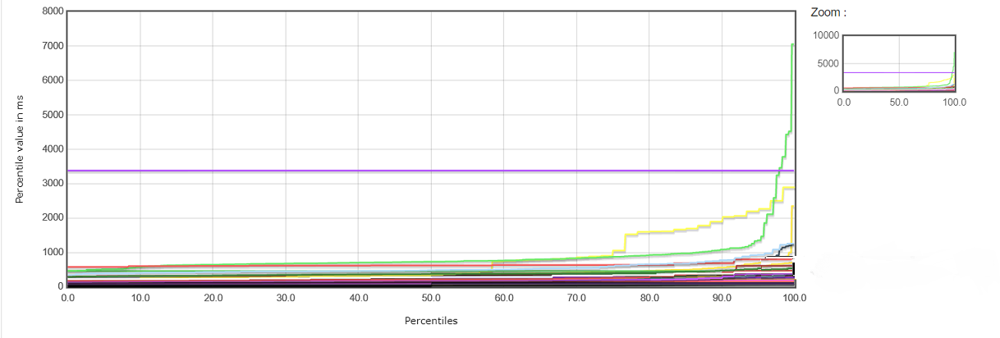

# Performance Testing

## Context

* These notes are part of a broader set of [principles](../principles.md)
* This is related to [Engineering quality-checks](https://digital.nhs.uk/about-nhs-digital/our-work/nhs-digital-architecture/principles/adopt-appropriate-cyber-security-standards)
* Related community of practice: [Test Automation Working Group](../communities/pd-test-automation-working-group.md)
* See also:
  * [Quality Metrics](../quality-checks.md) 
  * [Continuous integration](continuous-integration.md)
  * [Governance as a side effect](../patterns/governance-side-effect.md)
  * [Testing](testing.md)

## Introduction

Performance testing has a somewhat ambiguous meaning across the IT industry and is often used interchangeably with other testing terms such as load testing, stress testing, soak testing, etc.

For the sake of clarity this page will consider Performance Testing as per the definition on [Wikipedia](https://en.wikipedia.org/wiki/Software_performance_testing), namely:

>  performance testing is in general a testing practice performed to determine how a system performs in terms of responsiveness and stability under a particular workload. It can also serve to investigate, measure, validate or verify other quality attributes of the system, such as scalability, reliability and resource usage.

## How to start?

### Know your audience

* Identify common user interactions or journeys with your system
* Identify how many users are typically accessing your system at any given moment
* Calculate or estimate what percentage of those users will be performing a given interaction or journey at any given moment
* This information can then be used to design your thread groups in JMeter or similar grouping of interactions with other testing tools
* The information can then also be used to determine a "typical" load as well as being useful to realistically scale up load as part of your tests

### What does good look like?

* Identify clear targets for performance: performance testing should be an **objective** not subjective exercise
* Examples of possible targets might be: 
  * SLA based, e.g. all pages must respond within 4 seconds
  * Relative, e.g. any given release must not deteriorate performance by more than 5%
  * Weighted by interaction: if a user performs a particular interaction once every 3 months they are liable to be more accepting of a 8 second delay than a task which they perform many times a day
  * Weighted by load: in busy periods you may be willing to have a slightly longer response time
* Consider how your targets may be influenced by your architecture - for example if you are using a serverless "scale on demand" architecture your targets might be cost based

Ultimately your targets are a red flag that you need to investigate further

## Use of the APDEX index

[APDEX](https://en.wikipedia.org/wiki/Apdex) is a simple formula for calculating performance based on a target response time which would satisfy your users.  The reason it is useful is that it gives a definite figure between 0 and 1.0, where 1.0 means all of your users are happy and satisfied, and 0 means they are all unhappy and dissatisfied.

APDEX acts as a "smoothing" function and helps ameliorate the effect of outliers by purely classing performance times in terms of whether the user is satisfied, tolerating or frustrated.  Therefore, if you have a strict SLA around every page response time it may not be appropriate for you to use.  It is also important to choose a realistic target response time as otherwise, if it is overly lenient or overly generous, you will struggle to make much distinction between different performance test runs.  Repeated results of 0 or 1.0 aren't very useful.

APDEX is a useful index for pipelines as it gives a definite figure and is therefore a very objective measure as opposed to the more subjective, manual interpretation of standard load testing reports such as the JMeter example below:

As such APDEX can help us answer and take action (e.g. fail the pipeline) on such fundamental questions as:

* Are our users happy?
* Have we made performance worse?
* Would our users become unhappy when there is an increased load?

## A case study

For the Data Security Protection Toolkit (DSPT) we decided to use APDEX so that, prior to a fortnightly release, we could answer the question:

> Has this release made the performance of the system worse?

### A case study (know your audience)

Previously we had defined a list of user scenarios for the typical actions undertaken on the system which we named after Mr Men characters.  We also defined for every 100 users how many (i.e. what percentage) would be likely to be performing a given Mr Man scenario

We used these scenarios to define our thread groups within JMeter and decided we would run our performance tests for 250 users at a time which would represent a heavy load for the system.

### A case study (what does good look like?)

Previously we had performed Performance Testing in a fairly adhoc manner and even when we hooked just the JMeter tests into our Release Candidate pipeline we were forgetting to check the resulting report often.  When we did check we were finding it hard to compare against previous reports (if we still had them) and the whole process felt rather loose and subjective.  We decided we needed to improve this working practice.

In order to have an automatic, quantifiable quality gate we decided that we wanted to know if the performance for a particular scenario had degraded by more than 5% compared to previous average performance.  If it did we wanted to fail the pipeline so we could investigate any new pieces of code further.  Using the following approach we were able to achieve this aim and are currently using it.

### A case study (approach)

Although you can apply APDEX figures to JMeter it only calculates them per endpoint whereas we wanted to aggregate our APDEX figures at the Mr Man scenario level.

We therefore wrote a Python program which would take the raw JMeter results file (a sample of shown below) and using regular expressions to group results by thread names matching a Mr Man scenario, would calculate the aggregate APDEX score per scenario.

The Python program produces a file with the output below:

These figures were compared against the average by scenario of previous results files which had been stored in an S3 bucket by using an Athena database over the S3 bucket and the following query:

> SELECT type, key, avg(apdex) AS average FROM "dspt"."performance_test_results" GROUP BY type, key

Using the results of this query we could calculate any deterioration and fail the pipeline if needed.  If the results were within the 5% limit then the results file was simply added to the S3 bucket.  Additionally for information the results of the calculation are written to the Jenkins log as shown below:

### A case study - some caveats

Whilst we have found this approach useful there are certain caveats to it, for example:

* What if performance slowly degrades over time but always by less than 5% per release?
* It potentially hides an individual page or end point whose performance has degraded due to the aggregation/smoothing effect of APDEX.
* Recognition that we probably want in the future to also apply an absolute target e.g. APDEX of >= 0.9

### A case study - architecture

The following diagram summarises the approach taken to using APDEX by DSPT:

