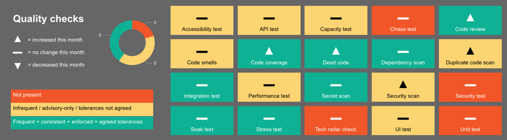

# Engineering quality-checks

This is part of a broader [quality framework](README.md) and forms a key part of the [metrics](insights/metrics.md) section.

## Summary

Quality checks are at the heart of good engineering, and are essential for rapid and safe delivery of software changes. This page provides an index of the various quality checks described within our principles, patterns and practices.

The checks are classified here based on the concerns they help to address:

* Functionality
* Security
* Resilience
* Maintainability

## Usage

All applicable quality checks should be applied. Not all checks are universal, i.e. applicable in all contexts. For example, accessibility testing is only applicable to applications with a user interface.

The majority of these checks should be [automated](./patterns/automate-everything.md) via [continuous integration / continuous deployment](./practices/continuous-integration.md): the optimal sequencing of these checks within CI/CD pipelines will depend on the project's branching strategy, deployment strategy, etc.

All of these checks are important, even where their purpose overlaps with other checks in the list. For example, comprehensive functional testing could be achieved without unit testing, instead only using the other functional test types on this list - this would result in a very long-running and inefficient test suite, precluding fast feedback and impeding rapid and safe delivery of software changes. For further details please see [test practices](./practices/testing.md), and especially the [test pyramid](https://martinfowler.com/articles/practical-test-pyramid.html).

Although we separate resilience checks into their notional components, when it comes to implementation these may be joined up where useful. For example, an automated test suite may test the application for peak load and then drop down to sustained load in order to conduct a soak test.

## RAG scale

We rate our applications against each of these checks as follows:

* Green = the quality check is applied frequently and consistently (in practice this typically means [automated](./patterns/automate-everything.md) via [continuous integration / continuous deployment](./practices/continuous-integration.md)), the output of the check is a quality gate (as opposed to just a warning / for information), and the tolerances for that quality gate (e.g. code coverage %) are agreed and understood.
* Amber = the quality check is applied, but not all conditions for green are met - for example the check generates warnings that may or may not be acted on, or is executed on an ad-hoc basis and cannot offer a consistent quality gate guarantee.
* Red = the quality check is not applied.
* N/A = the quality check is not applicable.

## Tracking progress

We recommend tracking progress on an Engineering Quality dashboard, for example:

## Details

| Quality check          | Classification  | Applicability | What it means                                                                                                                                                                                                   | Why we care                                                                                                                                                                                                                                                | Tolerances for green                                                                                                                                                     | Endorsed tools / configuration                                                | Further details                                                                                               |
| :--------------------- | :-------------- | :------------ | :-------------------------------------------------------------------------------------------------------------------------------------------------------------------------------------------------------------- | :--------------------------------------------------------------------------------------------------------------------------------------------------------------------------------------------------------------------------------------------------------- | :----------------------------------------------------------------------------------------------------------------------------------------------------------------------- | :---------------------------------------------------------------------------- | :------------------------------------------------------------------------------------------------------------ |
| Unit tests             | Functionality   | Universal     | Logic tests for individual blocks of code, e.g. individual methods                                                                                                                                              | This is the quickest (to execute) type of functional test, so these are essential to achieve both rapid and thorough functional testing                                                                                                                    | Builds fail if any tests fail                                                                                                                                            | -                                                                             | [Test practices](./practices/testing.md)                                                                      |
| Integration tests      | Functionality   | Universal     | Check interactions with other components and dependant systems. e.g. across microservices, authentication layers, database, third-party systems. Ideally includes full end-to-end testing across all components | When components are developed in isolation, it's vital that we regularly test them working together. Changes in one component can break the whole system                                                                                                   | Builds fail if any tests fail                                                                                                                                            |                                                                               |                                                                                                               |
| API / contract tests   | Functionality   | Contextual    | Check whether the API interface adheres to the agreed contract                                                                                                                                                  | Any API interface is an integration point with another component or a software systems. An extra care has to be taken to ensure compatibility and stability of that integration are maintained so that we don't break applications that depend on our APIs | Builds fail if any tests fail                                                                                                                                            | Postman                                                                       | [Automate Your API Tests with Postman](https://www.postman.com/use-cases/api-testing-automation/)             |
| UI tests               | Functionality   | Contextual    | Check that the user interface components behave as expected, particularly checking the visual elements to verify that they are functioning according to requirements                                                                                                                                                                                                                | As the only aspects of software that end users come into contact with, it is essential that these elements behave as expected and allow users to get only what they need from our software applications                                                                                                                                                                                                                                                           | Builds fail if any tests fail                                                                                                                                            |                                                                               |                                                                                                               |
|  Secret scanning        | Security        | Universal     | Check for secrets (e.g. passwords, IP addresses, etc) accidentally included in software code                                                                                                                    | This protects us against accidentally leaking secrets (in source code) which could compromise the security of the application                                                                                                                              | Review the list of patterns and update it as necessary  ... then:  Full repository (including history) scan, and all secrets removed  And:  Local (on developer laptop) scanning to block commits containing the patterns   And:  Server-side scanning within the code repository for new commits containing the patterns| [nhsd-git-secrets](tools/nhsd-git-secrets/)| |
| Security code analysis | Security        | Universal     | Check for indications of possible security issues (for example injection weaknesses)                                                                                                                            | This gives fast feedback about security issues.    Code analysis is not as thorough as security testing in terms of finding complex weaknesses or issues that only manifest themselves at runtime, but it has much greater coverage. It's a better option for finding simple weaknesses and it's much quicker to execute.    Security code analysis and security testing are both important to achieve rapid and thorough security testing. | If using SonarQube, must use SonarQube's default [rules, profiles and gateways](tools/sonarqube.md#default-quality-gates)    Build pipeline must fail if gateway is not met | One option is [SonarQube](tools/sonarqube.md). For the purpose of security code analysis, Developer Edition or higher is required as it includes advanced OWASP scanning. |                                                                                                               |
| Security testing       | Security        | Contextual    | Check for security issues (for example injection weaknesses)                                                                                                                                                    | More thorough than security code scanning, but much slower to execute, so both are important to achieve both rapid and thorough security testing |  | |                                                                                                               |
| Dependency scanning | Security | Universal | Check for security issues and vulnerabilities in dependent areas of code that are outside of our direct control | Without this we have no way of knowing of any issues or security vulnerabilities of third party components that we are not responsible for | Must check against CVE database   Must check dependencies of dependencies   Must fail build if any [High](https://www.imperva.com/learn/application-security/cve-cvss-vulnerability/) severity vulnerabilities are found   It should be easy to determine why the build failed: which vulnerability it was, and in which top-level dependency   Tools must include ability to exclude accepted vulnerabilities. These should include a date at which the exclusion expires and the build fails again. These should include a description of why they are excluded | One option is (other options are being added): [dependency-check-maven](tools/dependency-check-maven/README.md) | |
| Performance tests      | Resilience      | Contextual    | Check whether application performance is acceptable at different levels of load. This may include:  * Baseline test (one-off) - to establish how the system interacts  * Smoke test - to establish that the key functionality is working before performing longer tests  * Regression test - run a suite of repeatable test cases to validate existing functionality  * Load test - to understand the system behaviour under an expected load                                    | Without these tests, we don't know how load will affect the performance of the application, or whether existing functionality has been broken.                           | The performance of the system must be scored at build time so that it can be tracked  Build pipeline must fail if performance does not meet the acceptable level                                                                                                                                                                         | One option is to use [APDEX](https://en.wikipedia.org/wiki/Apdex) to quantify performance to a numeric value, and to use this value to pass/fail the build pipeline                                                                              |                                                                                                               |
| Capacity tests         | Resilience      | Contextual    | Identify the application's breaking point in terms of an increasingly heavy load. Degradation may manifest itself as  * throughput bottlenecks * increasing response times * error rates rising     | Without this test, we don't know how much load the application can handle before the application breaks or degrades  |                                                                                                                                                                          |                                                                               |                                                                                                               |
| Stress tests           | Resilience      | Contextual    | Check how the system performs under stress including   * a level load near the maximum capacity for a prolonged period  * sudden spikes in load with a lower baseline load                              | Without this test, we don't know if the application will begin to fail as a result of memory leaks, connection pool blocking etc. or will fail under a sharp increase in load triggered by adverts, news coverage or TV tea breaks                         |                                                                                                                                                         |                                                                               |                                                                                                               |
| Soak tests             | Resilience      | Contextual    | Check whether sustained heavy load for a significantly extended period causes a problem such as memory leaks, loss of instances, database failovers etc.                                                        | Without this test, we don't know if application performance will suffer under prolonged heavy load, how stable the system is, how it performs without interventions.                                                                                       |                                                                                                                                                                          |                                                                               |                                                                                                               |
| Chaos tests            | Resilience      | Contextual    | Cause failures in a system to test the resiliency of that system and its environment, and our ability to respond to failures                                                                                                                                                                                                                | Give the team confidence that failures in a given environment will not lead to unplanned downtime or a negative user experience  Ensures that the team has visibility (e.g. dashboards and alerts) to be able to identify issues  Surface performance bottlenecks, weaknesses in system design and tipping points that aren't visible through other types of testing.   Help the team to understand their mean time to recovery (MTTR) and to build muscle memory & confidence for recovery activities                                                                                                                                                                                                                                                           | Regular (at least every couple of months) game days, and:  Builds fail if any test fails - note, these tests are slow, and are likely to be part of an infrequently-triggered (e.g. overnight) build  The tests cover whether the system self-heals, auto-scales, and alerts as expected                                                                                                                        |[aws-fis](tools/aws-fis/)                                                                               |                                                                                                               |
| Code coverage          | Maintainability | Universal     | The proportion of the application code which is executed (in this context: during testing)                                                                                                                      | The higher the code coverage, the more thorough the testing, and therefore the higher the likelihood of detecting functional issues early                                                                                                                  | Must use SonarQube's default [rules, profiles and gateways](tools/sonarqube.md#default-quality-gates)    Build pipeline must fail if gateway test coverage is not met    For [new code](tools/sonarqube.md#definition-of-new-code), must meet coverage specified in default Sonarqube gateway.   For legacy code, coverage amount can be initially lowered to deal with historic tech debt. But must have a plan for increasing coverage over time. | [SonarQube](tools/sonarqube.md) (in conjunction with testing frameworks)                                                                            |                                                                                                               |
| Duplicate code scan    | Maintainability | Universal     | Check whether the same code is used in multiple places                                                                                                                                                                                                                | Duplicate code increases the cost and risk of making software changes and will increase exponentially over time | Must use SonarQube's default [rules, profiles and gateways](tools/sonarqube.md#default-quality-gates)    Build pipeline must fail if gateway is not met | [SonarQube](tools/sonarqube.md) |                                                                                                               |
| Code smells scan       | Maintainability | Universal     | Check whether the software code adheres to the principles, patterns and practices of writing clean code                                                                                                         | The code is written once but read and executed many times. If the code is not clean, the cost and risk of making software changes both increase exponentially over time | Must use SonarQube's default [rules, profiles and gateways](tools/sonarqube.md#default-quality-gates)    Build pipeline must fail if gateway is not met | [SonarQube](tools/sonarqube.md) | [Clean Code: Smells and Heuristics](https://moderatemisbehaviour.github.io/clean-code-smells-and-heuristics/) |
| Dead code scan         | Maintainability | Universal     | Detecting unused code and files that are not needed                                                                                                                                                                                                                | Code is written once but read and executed many times. The more code you have, the greater the risk of somethign going wrong                                                                                                                                                                                                                                                           |                                                                                                                                                                          |                                                                               |                                                                                                               |
| Code review            | Other           | Universal     | A second person manually checking a code change                                                                                                                                                                 | Quality check by a human, as opposed to via a tool                                                                                                                                                                                                         | Enforced & audited step within workflow                                                                                                                                  | TBC                                                                           | [Code review guidance](./patterns/everything-as-code.md#code-review)                                          |
| Accessibility tests    | Other           | Universal     | The practice of making applications usable by as many people as possible.                                                                                                                                                                                                                 | It is a regulatory requirement that our applications are accessible by as many people as possible. Catching accessibility failures up front is essential to maximise the accessibility                                                                                                                                                                                                                                                           |                                                                                                                                                                          |                                                                               |                                                                                                               |
| Tech radar check       | Other           | Universal     | Checking that the tools to be used are in line with organisational / team standards                                                                                                                                                                                                                | To prevent the unnecessary proliferation of a wide variety of tools and technologies, which would have a negative impact on overall effectiveness                                                                                                                                                                                                                                                           |                                                                                                                                                                          |                                                                               |                                                                                                               |

## Publishing code

All code should be treated the same and treated well (please see [everything as code](./patterns/everything-as-code.md)), but code that is being published (i.e. made available outside of NHS Digital, for example in a public repository on GitHub) incurs additional considerations.

For example, it's never good to include credentials and other secrets in source code, but the impact of this is obviously greater if the code is made available to the public.

Therefore, for published code, the following minimums are required:
  * Unit tests: GREEN
  * Integration tests: AMBER (where applicable)
  * API / contract tests: AMBER (where applicable)
  * UI tests: AMBER (where applicable)
  * Secret scanning: AMBER (including removal of any secrets)
  * Security code analysis and Security testing: AMBER for at least one of these
  * Dependency scanning: AMBER
  * Code coverage: AMBER
  * Duplicate code scan: AMBER
  * Code smells scan: AMBER
  * Dead code scan: AMBER
  * Code review: GREEN
  * Accessibility tests: AMBER (where applicable)
