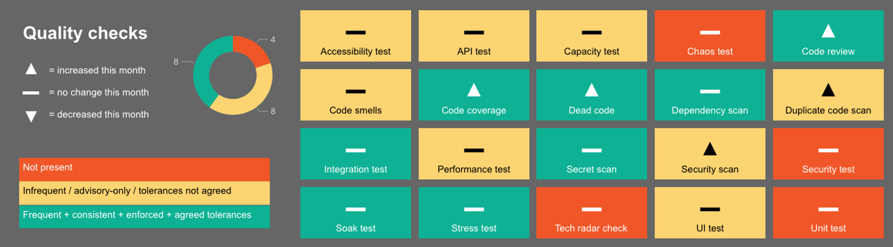

# Engineering quality-checks

This is part of a broader [quality framework](README.md) and forms a key part of the [metrics](metrics.md) section.

## Summary

Quality checks are at the heart of good engineering, and are essential for rapid and safe delivery of software changes. This page provides an index of the various quality checks described within our principles, patterns and practices.

The checks are classified here based on the concerns they help to address:

* Functionality
* Security
* Resilience
* Maintainability

## Usage

All applicable quality checks should be applied. Not all checks are applicable in all contexts, for example accessibility testing is only applicable to applications with a user interface.

The majority of these checks should be [automated](./patterns/automate-everything.md) via [continuous integration / continuous deployment](./practices/continuous-integration.md): the optimal sequencing of these checks within CI/CD pipelines will depend on the project's branching strategy, deployment strategy, etc.

All of these checks are important, even where their purpose overlaps with other checks in the list. For example, comprehensive functional testing could be achieved without unit testing, instead only using the other functional test types on this list - this would result in a very long-running and inefficient test suite, precluding fast feedback and impeding rapid and safe delivery of software changes. For further details please see [test practices](./practices/testing.md), and especially the [test pyramid](https://martinfowler.com/articles/practical-test-pyramid.html).

## RAG scale

We rate our applications against each of these checks as follows:

* Green = the quality check is applied frequently and consistently (in practice this typically means [automated](./patterns/automate-everything.md) via [continuous integration / continuous deployment](./practices/continuous-integration.md)), the output of the check is a quality gate (as opposed to just a warning / for information), and the tolerances for that quality gate (e.g. code coverage %) are agreed and understood
* Amber = the quality check is applied, but not all conditions for green are met - for example the check generates warnings that may or may not be acted on
* Red = the quality check is not applied
* N/A = the quality check is not applicable

## Tracking progress

We recommend tracking progress on an Engineering Quality dashboard, for example:

## Details

| Quality check          | Classification  | Applicability | What it means                                                                                                                                                                                                   | Why we care                                                                                                                                                                                                                                                | Tolerances for green                                                                                                                                                     | Endorsed tools / configuration                                                | Further details                                                                                               |
| :--------------------- | :-------------- | :------------ | :-------------------------------------------------------------------------------------------------------------------------------------------------------------------------------------------------------------- | :--------------------------------------------------------------------------------------------------------------------------------------------------------------------------------------------------------------------------------------------------------- | :----------------------------------------------------------------------------------------------------------------------------------------------------------------------- | :---------------------------------------------------------------------------- | :------------------------------------------------------------------------------------------------------------ |
| Unit tests             | Functionality   | Universal     | Logic tests for individual blocks of code, e.g. individual methods                                                                                                                                              | This is the quickest (to execute) type of functional test, so these are essential to achieve both rapid and thorough functional testing                                                                                                                    | Builds fail if any tests fail                                                                                                                                            | -                                                                             | [Test practices](./practices/testing.md)                                                                      |
| Integration tests      | Functionality   | Universal     | Check interactions with other components and dependant systems. e.g. across microservices, authentication layers, database, third-party systems. Ideally includes full end-to-end testing across all components | When components are developed in isolation, it's vital that we regularly test them working together. Changes in one component can break the whole system                                                                                                   | Builds fail if any tests fail                                                                                                                                            |                                                                               |                                                                                                               |
| API / contract tests   | Functionality   | Contextual    | Check whether the API interface adheres to the agreed contract                                                                                                                                                  | Any API interface is an integration point with another component or a software systems. An extra care has to be taken to ensure compatibility and stability of that integration are maintained so that we don't break applications that depend on our APIs | Builds fail if any tests fail                                                                                                                                            | Postman                                                                       | [Automate Your API Tests with Postman](https://www.postman.com/use-cases/api-testing-automation/)             |
| UI tests               | Functionality   | Contextual    | Check that the user interface components behave as expected, particularly checking the visual elements to verify that they are functioning according to requirements                                                                                                                                                                                                                | As the only aspects of software that end users come into contact with, it is essential that these elements behave as expected and allow users to get only what they need from our software applications                                                                                                                                                                                                                                                           | Builds fail if any tests fail                                                                                                                                            |                                                                               |                                                                                                               |
| Secret scanning        | Security        | Universal     | Check for secrets (e.g. passwords, IP addresses, etc) accidentally included in software code                                                                                                                    | This protects us against accidentally leaking secrets (in source code) which could compromise the security of the application                                                                                                                              | Covering all of the patterns listed in the [security practices](/practices/security.md#application-level-security):  Full repository (including history) scan, and all secrets removed  And:  Local (on developer laptop) scanning to block commits containing the patterns   And:  Server-side scanning within the code repository for new commits containing the patterns| One-off scanning, and ongoing local scanning: [Git-secrets](https://github.com/awslabs/git-secrets) [GitLeaks](https://github.com/zricethezav/gitleaks)   Code-repository scanning: TBC                                                      | [Security practices ("don't trust yourself or others")](/practices/security.md#application-level-security)|
| Security code analysis | Security        | Universal     | Check for indications of possible security issues (for example injection weaknesses)                                                                                                                            | This gives fast feedback about security issues: it's not as thorough as security testing, but it's much quicker to execute, so both are important to achieve both rapid and thorough security testing                                                      |                                                                                                                                                                          |                                                                               |                                                                                                               |
| Security testing       | Security        | Contextual    | Check for security issues (for example injection weaknesses)                                                                                                                                                    | More thorough than security code scanning, but much slower to execute, so both are important to achieve both rapid and thorough security testing                                                                                                           |                                                                                                                                                                          |                                                                               |                                                                                                               |
| Dependency scanning    | Security        | Universal     | Check for security issues and vulnerabilities in dependent areas of code that are outside of our direct control                                                                                                                                                                                                                | Without this we have no way of knowing of any issues or security vulnerabilities of third party components that we are not responsible for                                                                                                                                                                                                                                                           |                                                                                                                                                                          |                                                                               |                                                                                                               |
| Performance tests      | Resilience      | Contextual    | Check whether application performance is acceptable at different levels of load                                                                                                                                 | Without this test, we don't know how load will affect the performance of the application                                                                                                                                                                   |                                                                                                                                                                          |                                                                               |                                                                                                               |
| Capacity tests         | Resilience      | Contextual    | Identify the application's breaking point in terms of heavy load                                                                                                                                                | Without this test, we don't know how much load the application can handle before the application breaks                                                                                                                                                    |                                                                                                                                                                          |                                                                               |                                                                                                               |
| Stress tests           | Resilience      | Contextual    | Check whether sudden spikes in load cause a problem                                                                                                                                                             | Without this test, we don't know if the application will fail under a sharp increase in load                                                                                                                                                               |                                                                                                                                                                          |                                                                               |                                                                                                               |
| Soak tests             | Resilience      | Contextual    | Check whether sustained heavy load causes a problem                                                                                                                                                             | Without this test, we don't know if application performance will suffer under prolonged heavy load                                                                                                                                                         |                                                                                                                                                                          |                                                                               |                                                                                                               |
| Chaos tests            | Resilience      | Contextual    | Continuously and randomly cause failures in a system, to test the resiliency of the system and the environment, and help the team to understand their MTTR                                                                                                                                                                                                                | Give the team confidence that failures in a given environment will not lead to unplanned downtime or a negative user experience                                                                                                                                                                                                                                                           |                                                                                                                                                                          |                                                                               |                                                                                                               |
| Code coverage          | Maintainability | Universal     | The proportion of the application code which is executed (in this context: during testing)                                                                                                                      | The higher the code coverage, the more thorough the testing, and therefore the higher the likelihood of detecting functional issues early                                                                                                                  | For new code: 70%                                                                                                                                                        |                                                                               |                                                                                                               |
| Duplicate code scan    | Maintainability | Universal     | Check whether the same code is used in multiple places                                                                                                                                                                                                                | Duplicate code increases the cost and risk of making software changes and will increase exponentially over time                                                                                                                                                                                                                                                            |                                                                                                                                                                          |                                                                               |                                                                                                               |
| Code smells scan       | Maintainability | Universal     | Check whether the software code adheres to the principles, patterns and practices of writing clean code                                                                                                         | The code is written once but read and executed many times. If the code is not clean, the cost and risk of making software changes both increase exponentially over time                                                                                    |                                                                                                                                                                          | [SonarQube](https://www.sonarqube.org/) | [Clean Code: Smells and Heuristics](https://moderatemisbehaviour.github.io/clean-code-smells-and-heuristics/) |
| Dead code scan         | Maintainability | Universal     | Detecting unused code and files that are not needed                                                                                                                                                                                                                | Code is written once but read and executed many times. The more code you have, the greater the risk of somethign going wrong                                                                                                                                                                                                                                                           |                                                                                                                                                                          |                                                                               |                                                                                                               |
| Code review            | Other           | Universal     | A second person manually checking a code change                                                                                                                                                                 | Quality check by a human, as opposed to via a tool                                                                                                                                                                                                         | Enforced & audited step within workflow                                                                                                                                  | TBC                                                                           | [Code review guidance](./patterns/everything-as-code.md#code-review)                                          |
| Accessibility tests    | Other           | Universal     | The practice of making applications usable by as many people as possible.                                                                                                                                                                                                                 | It is a regulatory requirement that our applications are accessible by as many people as possible. Catching accessibility failures up front is essential to maximise the accessibility                                                                                                                                                                                                                                                           |                                                                                                                                                                          |                                                                               |                                                                                                               |
| Tech radar check       | Other           | Universal     | Checking that the tools to be used are in line with organisational / team standards                                                                                                                                                                                                                | To prevent the unnecessary proliferation of a wide variety of tools and technologies, which would have a negative impact on overall effectiveness                                                                                                                                                                                                                                                           |                                                                                                                                                                          |                                                                               |                                                                                                               |
